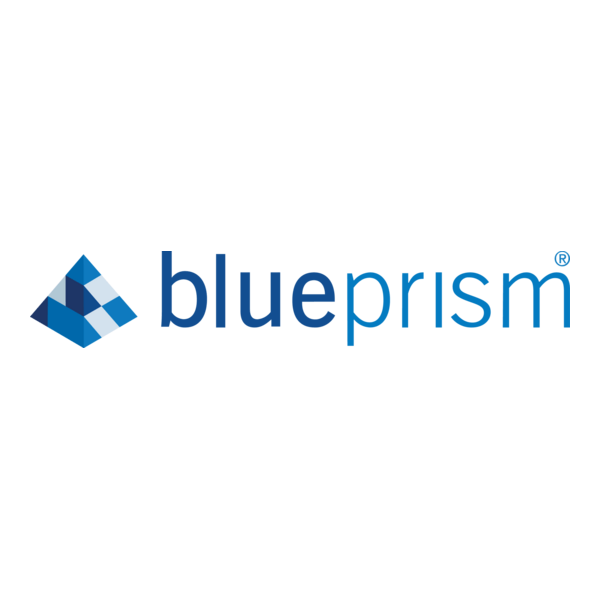

<h1 align="center">Hi 👋, I'm Patryk Tecza</h1>
<h3 align="center">A passionate RPA developer from Poland</h3>

  

🔭 I work with Blue Prism, UiPath, VBA, and Alteryx, focusing on end‑to‑end business process automation
🤖 I develop advanced Blue Prism bots for automated data extraction from SAP (including multiple SAP tables and SAP HANA via SQL queries)
⚙️ I build solutions that combine SAP data extraction, data processing in Alteryx, and automated report distribution via Blue Prism to multiple business teams
🔗 I use VBA for SAP integrations and automation support, especially where tight Excel–SAP interaction is required
📊 I process and enrich SAP data using Alteryx workflows with embedded Python scripts
🤝 I’m open to collaborating on RPA and intelligent automation projects, particularly SAP‑driven automation use cases
💬 Ask me about Blue Prism automation, SAP data extraction, Alteryx + Python workflows, or building production‑ready RPA solutions
📫 How to reach me: patryk-tecza@wp.pl
⚡ Fun fact: I like beatbox

<h3 align="left">🛠️ RPA Tools and Technologies:</h3>

  
  
  
  
  

&nbsp;

