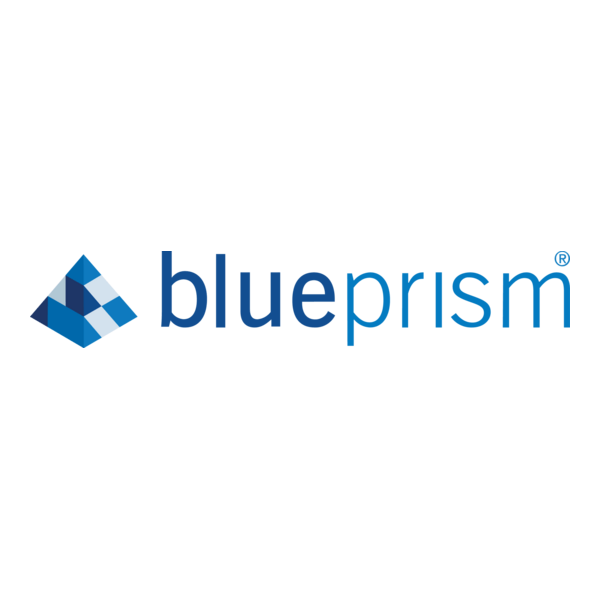

<h1 align="center">Hi 👋, I'm Patryk Tecza</h1>
<h3 align="center">A passionate RPA developer from Poland</h3>

  

  

- 🔭 I’m currently working with VBA and Alteryx 

- 🌱 I’m currently learning RPA tools like Blue Prism and UI Path

- 🤖 I’m interested in collaborating on beginner RPA projects or automation use cases

- 🤝 I’m looking for help with RPA best practices

- 💬 Ask me about Automation, data workflows, or getting started with RPA tools.

- 📫 How to reach me **patryk-tecza@wp.pl**

- ⚡ Fun fact **I like beatbox**

<h3 align="left">RPA Tools and Technologies:</h3>

  
  
  
  
  
  

&nbsp;

